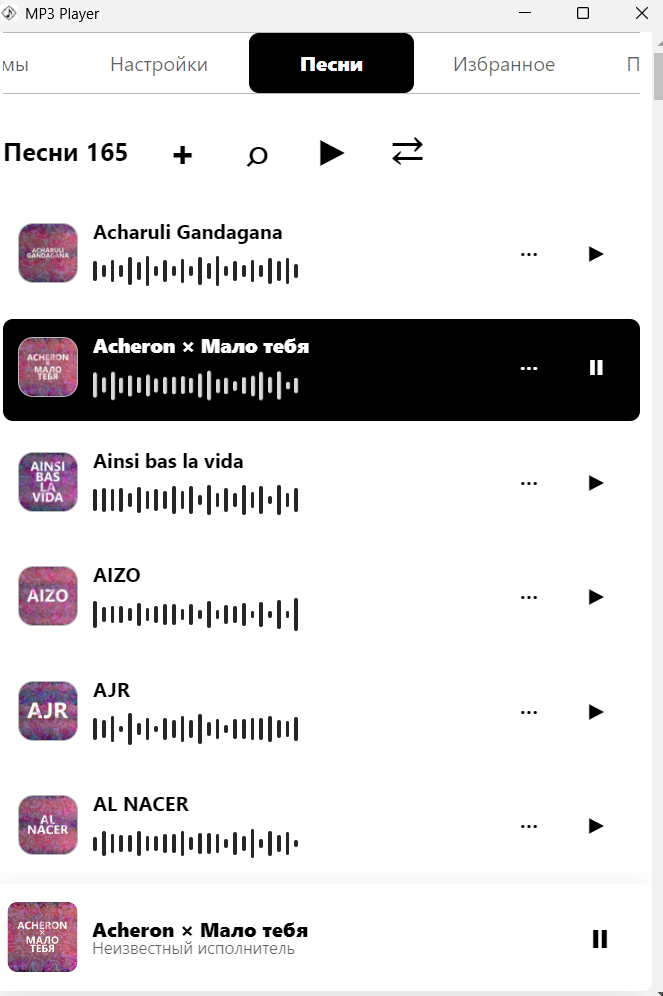
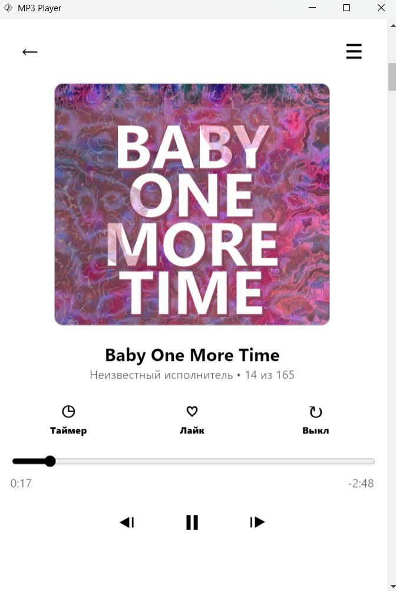
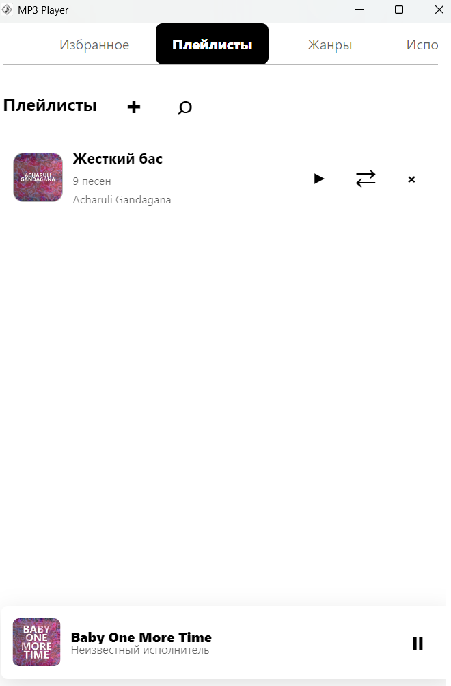
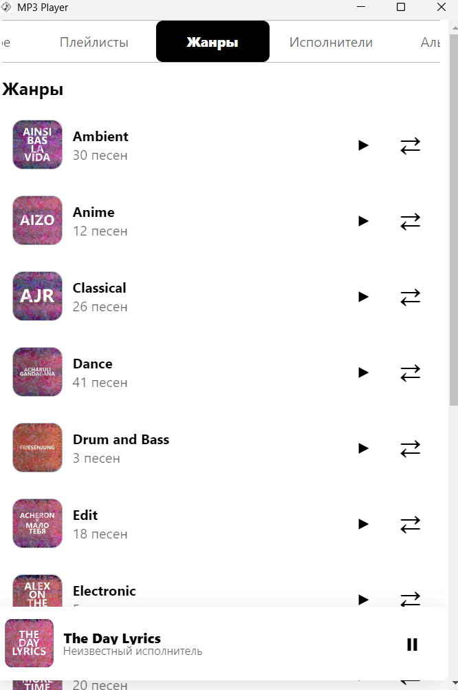
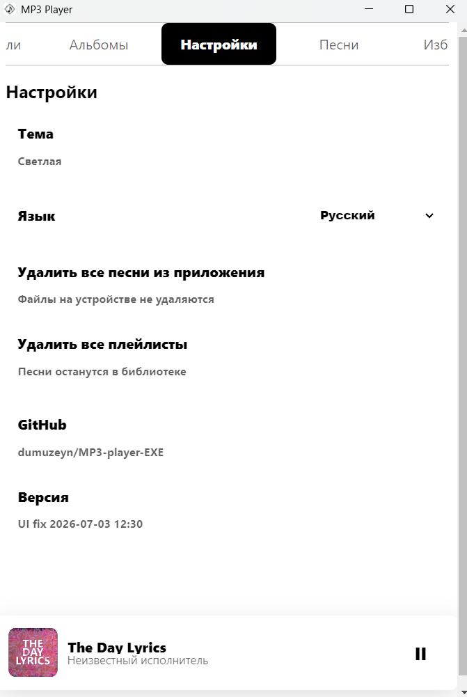

# MP3 Player

**MP3 Player** - настольный музыкальный плеер для Windows. Приложение собирается в самостоятельный `.exe` файл: пользователь скачивает один файл, запускает его и слушает музыку без браузера, локального сервера и дополнительных папок.

[English version](#english-version)

<p>
  <a href="https://github.com/dumuzeyn/MP3-player-EXE/raw/main/dist/MP3-Player-1.0.0-portable.exe">
    <kbd><strong>Скачать MP3 Player для Windows (.exe)</strong></kbd>
  </a>
</p>

Локальный файл после сборки находится здесь:

```text
dist/MP3-Player-1.0.0-portable.exe
```

## Возможности

- Добавление музыки кнопкой `+` через системный выбор файлов Windows.
- Добавление музыки перетаскиванием MP3-файлов прямо в окно приложения.
- Принимаются только `.mp3`, чтобы случайные файлы не попадали в медиатеку.
- Можно добавить большую пачку песен за раз; импорт идет порциями, чтобы интерфейс не зависал.
- Песни запоминаются после перезапуска приложения.
- Приложение хранит путь к исходному MP3-файлу, но не удаляет и не перезаписывает музыку пользователя.
- Чтение ID3-метаданных: название, исполнитель, альбом, жанр и встроенная обложка.
- Обложки показываются в списке песен, мини-плеере, большом плеере, жанрах, альбомах, исполнителях и плейлистах.
- Разделы: `Песни`, `Избранное`, `Плейлисты`, `Жанры`, `Исполнители`, `Альбомы`, `Настройки`.
- Поиск по песням, избранному и плейлистам.
- Поиск песни во время добавления трека в плейлист.
- Создание, открытие, наполнение, очистка и удаление плейлистов.
- Быстрое воспроизведение всего списка или случайного порядка.
- Большой плеер с обложкой, названием, исполнителем, прогрессом, временем, лайком, повтором и таймером сна.
- Мини-плеер внизу окна показывает текущую песню, обложку и кнопку play/pause; клик по мини-плееру открывает большой режим.
- Музыка продолжает играть после закрытия окна: приложение прячется в трей, откуда его можно открыть или полностью закрыть.
- Поддержка системной медиапанели Windows через Media Session API: название, исполнитель, обложка, play/pause, next/previous и позиция трека.
- Верхнее меню вкладок можно прокручивать и перетаскивать; оно закреплено сверху при вертикальной прокрутке страницы.
- Светлая и темная тема.
- Русский и английский интерфейс через выпадающий список языка.

## Скриншоты

Пустая медиатека с кнопкой добавления и drag and drop:


Список песен с обложками, быстрыми кнопками и мини-плеером:



Большой плеер с полной обложкой, таймером, лайком, повтором и прогрессом:



Плейлисты с обложками, количеством песен и быстрым запуском:



Жанры, исполнители и альбомы собираются из метаданных MP3:



Настройки темы, языка, очистки медиатеки и ссылки на GitHub:



## Как это работает

MP3 Player построен как Electron-приложение. Внутри используется Chromium-интерфейс, но пользователь не открывает браузер: Electron запускает обычное Windows-окно с локальным `index.html`, `styles.css` и `app.js`.

Основной процесс Electron (`main.js`) отвечает за системные возможности:

- создание окна приложения;
- иконку и меню в системном трее;
- системный выбор MP3-файлов;
- безопасное чтение выбранных локальных файлов;
- передачу данных в интерфейс через ограниченный IPC API;
- запрет произвольных переходов, новых окон и сетевых запросов из интерфейса.

Preload-слой (`preload.js`) открывает в renderer только минимальные методы: выбрать MP3-файлы, прочитать выбранные MP3-файлы и открыть разрешенную ссылку GitHub. В renderer нет прямого Node.js-доступа.

Интерфейс (`app.js`) отвечает за медиатеку, поиск, плейлисты, избранное, обложки, воспроизведение, таймер, очередь, большой плеер, мини-плеер и смену вкладок. Чтобы приложение не тормозило на больших списках, вкладки `Песни` и `Избранное` рендерятся отдельно, а активная вкладка не пересоздается без изменения данных. Переход через край меню использует легкие placeholder-клоны, а не копии всей медиатеки.

## Хранение данных

- Список песен и технические данные сохраняются локально в IndexedDB.
- Избранное, плейлисты, язык, тема и последняя вкладка сохраняются в localStorage.
- Исходные MP3-файлы остаются на месте, где их выбрал пользователь.
- Если файл вручную переместить или удалить с компьютера, запись может остаться в медиатеке, но старый путь уже не сможет воспроизвестись.
- Удаление песни из приложения удаляет только запись из медиатеки, а не файл пользователя.

## Безопасность

- Renderer работает без Node.js-доступа.
- Включены `contextIsolation` и `sandbox`.
- IPC-запросы принимаются только от локального `index.html` приложения.
- Чтение файлов ограничено абсолютными путями к `.mp3`.
- Пакетное чтение ограничено количеством файлов.
- В приложении нет IPC-команд для записи, перезаписи или удаления пользовательских файлов.
- Включена Content Security Policy.
- Произвольные переходы, новые окна, фреймы и сетевые подключения из интерфейса заблокированы.
- Внешняя ссылка разрешена только на репозиторий проекта GitHub.

## Технологии

- **Electron** - настольная оболочка Windows-приложения.
- **Chromium HTMLAudioElement / Media Session API** - воспроизведение MP3 и интеграция с системной медиапанелью.
- **JavaScript** - логика плеера, медиатеки, плейлистов, поиска и интерфейса.
- **HTML/CSS** - разметка и адаптивный интерфейс.
- **IndexedDB** - локальное хранение медиатеки.
- **localStorage** - настройки, избранное, плейлисты и выбранная вкладка.
- **electron-builder** - сборка Windows-приложения.
- **NSIS** - создание portable `.exe`, который временно распаковывает приложение и запускает `MP3 Player.exe`.

## Сборка

```bash
npm install
npm run dist:folder
makensis build-portable.nsi
```

После сборки готовый файл будет здесь:

```text
dist/MP3-Player-1.0.0-portable.exe
```

>**Автор проекта: Зейналов У.Р.о.**

---

## English Version

**MP3 Player** is a desktop music player for Windows. The app is packaged as a standalone `.exe` file: the user downloads one file, runs it, and listens to music without a browser, local server, or separate app folder.

[Русская версия](#mp3-player)

<p>
  <a href="https://github.com/dumuzeyn/MP3-player-EXE/raw/main/dist/MP3-Player-1.0.0-portable.exe">
    <kbd><strong>Download MP3 Player for Windows (.exe)</strong></kbd>
  </a>
</p>

The local build output is:

```text
dist/MP3-Player-1.0.0-portable.exe
```

## Features

- Add music with the `+` button through the native Windows file picker.
- Add music by dragging MP3 files into the app window.
- Only `.mp3` files are accepted, so unrelated files cannot enter the library by accident.
- Large batches of songs can be imported at once; import work is chunked to keep the UI responsive.
- Songs remain in the library after restarting the app.
- The app stores the source MP3 path but does not delete or overwrite the user's music files.
- ID3 metadata reading: title, artist, album, genre, and embedded cover art.
- Cover art is shown in the song list, mini player, full player, genres, albums, artists, and playlists.
- Sections: `Songs`, `Favorites`, `Playlists`, `Genres`, `Artists`, `Albums`, `Settings`.
- Search in songs, favorites, and playlists.
- Search while adding songs to a playlist.
- Create, open, fill, clear, and delete playlists.
- Play all or shuffle quickly.
- Full player with cover art, title, artist, progress, time, favorite, repeat, and sleep timer.
- Bottom mini player shows the current song, cover art, and play/pause button; clicking it opens the full player.
- Music keeps playing after the window is closed: the app hides in the tray and can be reopened or fully exited from there.
- Windows media panel support through the Media Session API: title, artist, cover art, play/pause, next/previous, and track position.
- The top tab menu can be scrolled and dragged; it stays fixed at the top while the page scrolls vertically.
- Light and dark themes.
- Russian and English interface with a language dropdown.

## Screenshots

Empty library with the add button and drag and drop:


Song list with cover art, quick controls, and mini player:


Full player with complete cover art, timer, favorite, repeat, and progress:


Playlists with cover art, song count, and quick playback:


Genres, artists, and albums are generated from MP3 metadata:


Settings for theme, language, library cleanup, and GitHub:


## How It Works

MP3 Player is built as an Electron app. It uses a Chromium-based interface internally, but the user does not open a browser: Electron starts a normal Windows window with local `index.html`, `styles.css`, and `app.js`.

The Electron main process (`main.js`) handles system-level features:

- creating the app window;
- tray icon and tray menu;
- native MP3 file picker;
- safe reading of selected local files;
- passing data to the interface through a limited IPC API;
- blocking arbitrary navigation, new windows, and network requests from the UI.

The preload layer (`preload.js`) exposes only the minimal methods needed by the interface: select MP3 files, read selected MP3 files, and open the allowed GitHub link. The renderer has no direct Node.js access.

The interface (`app.js`) handles the library, search, playlists, favorites, cover art, playback, timer, queue, full player, mini player, and tab switching. For smoother work with large libraries, `Songs` and `Favorites` are rendered separately, and the active tab is not rebuilt unless its data changes. Edge tab transitions use lightweight placeholder clones instead of cloning the whole song library.

## Data Storage

- Song records and technical data are stored locally in IndexedDB.
- Favorites, playlists, language, theme, and the last active tab are stored in localStorage.
- Source MP3 files stay where the user selected them.
- If the user moves or deletes an MP3 manually, the library entry can remain, but the old path will no longer play.
- Removing a song from the app removes only the library entry, not the user's file.

## Security

- Renderer runs without Node.js access.
- `contextIsolation` and `sandbox` are enabled.
- IPC requests are accepted only from the local app `index.html`.
- File reading is restricted to absolute `.mp3` paths.
- Batch reading is limited by file count.
- The app has no IPC command for writing, overwriting, or deleting user files.
- Content Security Policy is enabled.
- Arbitrary navigation, new windows, frames, and network connections from the UI are blocked.
- The only allowed external link is the project GitHub repository.

## Technologies

- **Electron** - desktop Windows app shell.
- **Chromium HTMLAudioElement / Media Session API** - MP3 playback and system media panel integration.
- **JavaScript** - player, library, playlist, search, and UI logic.
- **HTML/CSS** - layout and responsive interface.
- **IndexedDB** - local library storage.
- **localStorage** - settings, favorites, playlists, and active tab.
- **electron-builder** - Windows app build.
- **NSIS** - portable `.exe` generation that temporarily extracts the app and launches `MP3 Player.exe`.

## Build

```bash
npm install
npm run dist:folder
makensis build-portable.nsi
```

The final file is created here:

```text
dist/MP3-Player-1.0.0-portable.exe
```

>**Author of project: Zeynalov U.R.o.**
